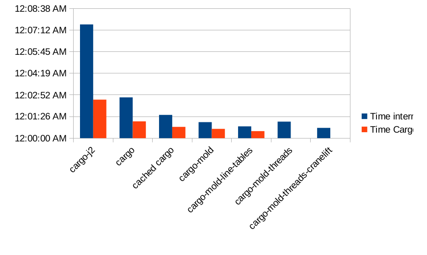
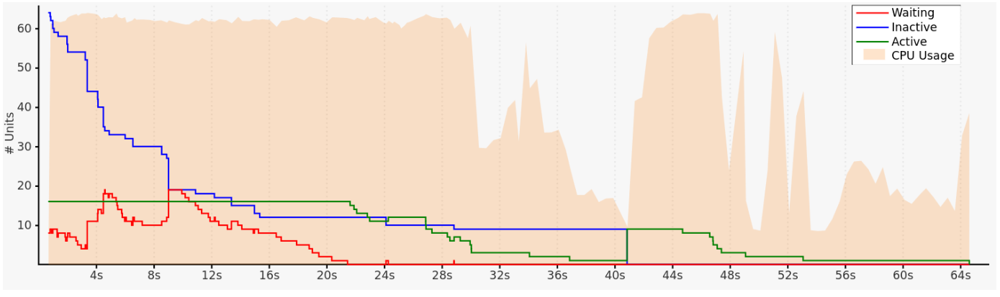

# Faster CI for Rust

---

# Common thread


---
# Ask questions!

---
# The project

```bash
$ find -name target -prune -o -name '*.rs' -print0 | wc -l --files0-from=- | sort -h | tail -1
237247 total
```

```bash
$ cargo metadata --format-version=1 | jq '.workspace_members | length'
37
```

---
# Baseline compile speed

---
# Baseline compile speed

```bash
$ . ./configs && cargo-j2 clean && cargo-j2 build --tests --timings
    Finished `dev` profile [unoptimized + debuginfo] target(s) in 7m 35s
  817.99s user 128.95s system 207% cpu 7:35.56 total
```


```bash
$ . ./configs && cargo-j2 clean && cargo-j2 build --tests --timings
    Finished dev [unoptimized + debuginfo] target(s) in 2m 34s
  227.40s user 39.45s system 172% cpu 2:34.59 total
```

---
# Tip #1: The more merrier

---
# Tip #1: The more merrier

```bash
$ . ./configs && cargo clean && cargo build --tests --timings
    Finished `dev` profile [unoptimized + debuginfo] target(s) in 2m 43s
  1604.35s user 236.79s system 1124% cpu 2:43.77 total
```

```bash
$ . ./configs && cargo clean && cargo build --tests --timings
    Finished dev [unoptimized + debuginfo] target(s) in 1m 07s
  379.35s user 71.90s system 669% cpu 1:07.42 total
```

---
# Tip #2: Cache dependencies

---
# Tip #2: Cache dependencies

```bash
$ . ./configs && cargo-clean-workspace cargo && cargo build --tests --timings
    Finished `dev` profile [unoptimized + debuginfo] target(s) in 1m 33s
  811.92s user 123.87s system 1001% cpu 1:33.40 total
```

```bash
$ . ./configs && cargo-clean-workspace-cargo cargo && cargo build --tests --timings
    Finished dev [unoptimized + debuginfo] target(s) in 45.02s
  151.89s user 15.78s system 372% cpu 45.060 total
```

---
# Beware of rebuilds!

---
# Tip #3: Use mold

---
# Tip #3: Use mold

```bash
$ . ./configs && cargo-clean-workspace cargo-mold && cargo-mold build --tests --timings
    Finished `dev` profile [unoptimized + debuginfo] target(s) in 1m 04s
  481.73s user 48.92s system 820% cpu 1:04.69 total
```

```bash
$ . ./configs && cargo-clean-workspace-cargo cargo-mold && cargo-mold build --tests --timings
    Finished dev [unoptimized + debuginfo] target(s) in 37.19s
  132.36s user 11.07s system 385% cpu 37.230 total
```

---
# Single line change with mold

```bash
$ . ./configs && cargo build --tests --timings
    Finished `dev` profile [unoptimized + debuginfo] target(s) in 35.21s
  189.04s user 48.20s system 672% cpu 35.286 total
```

```bash
$ . ./configs && cargo-mold build --tests --timings
    Finished `dev` profile [unoptimized + debuginfo] target(s) in 11.54s
  19.35s user 6.09s system 219% cpu 11.607 total
```

---
# Bonus tip: `debug = "line-tables-only"`


---
# Bonus tip: `debug = "line-tables-only"`


```bash
$ . ./configs && cargo-clean-workspace cargo-mold-line-tables && cargo-mold-line-tables build --tests
    Finished `dev` profile [unoptimized + debuginfo] target(s) in 47.83s
  366.53s user 37.79s system 843% cpu 47.909 total
```

---
# Bonus tip: `debug = "line-tables-only"` (Cargo)

```bash
$ . ./configs && cargo-clean-workspace-cargo cargo-mold-line-tables && cargo-mold-line-tables build --tests
    Finished dev [unoptimized + debuginfo] target(s) in 28.76s
  82.28s user 6.42s system 307% cpu 28.806 total
uild --tests
```

```bash
$ l -h target*/debug/cargo  
-rwxr-xr-x 2 user group 360M Apr 21 19:56 target-mold/debug/cargo
-rwxr-xr-x 2 user group 164M Apr 21 20:34 target-mold-line-tables/debug/cargo
```

---
# Overview



---
# Analyze build times with `--timings`



---
# Analyze cargo's build time

[Output of `cargo-mold build --test --timings` for cargo](faster-rust-ci/cargo-timing-cargo.html)
[Output of `cargo-mold build --test --timings` for cached cargo](faster-rust-ci/cargo-timing-cargo-cached.html)

---
# Up and coming: `-Z threads`

---
# Up and coming: `-Z threads`

```bash
$ . ./configs && cargo-clean-workspace cargo-mold-threads && cargo-mold-threads build --tests --timings
    Finished `dev` profile [unoptimized + debuginfo] target(s) in 1m 06s
  530.92s user 53.69s system 884% cpu 1:06.08 total
```

```bash
$ . ./configs && cargo-clean-workspace-cargo cargo-mold-threads && cargo-mold-threads build --tests --timings
    Finished dev [unoptimized + debuginfo] target(s) in 25.52s
  147.50s user 15.44s system 637% cpu 25.567 total
```

---
# Up and coming: Cranelift

---
# Up and coming: Cranelift

```bash
$ . ./configs && cargo-clean-workspace cargo-mold-threads-cranelift && cargo-mold-threads-cranelift build --tests
    Finished `dev` profile [unoptimized + debuginfo] target(s) in 41.57s
  250.16s user 46.27s system 711% cpu 41.653 total
 --timings
```

```
$ . ./configs && cargo-clean-workspace-cargo cargo-mold-threads-cranelift && cargo-mold-threads-cranelift build --tests --timings
    Finished dev [unoptimized + debuginfo] target(s) in 19.54s
  83.10s user 11.70s system 484% cpu 19.585 total
```

---
# Other tools: `cargo llvm-lines`

---
# Don't build - download!

```yml
- name: Setup cargo tools
 uses: taiki-e/install-action@v2
 with:
   tool: cargo-make,cargo-llvm-cov
```
---
# Tests

---
# Database pool connections

---
# `#[serial]`

